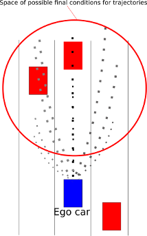
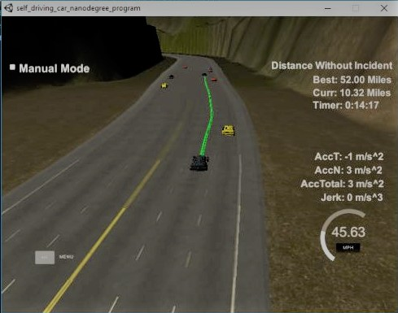

# Udacity Self-Driving Cars Engineer Nanodegree  
## Path Planning Project:
## A pure reactive jerk-minimizing approach
=====================


## 1. Little introduction  

During the 3rd term of the Self-Driving Cars Engineer Nanodegree, I had to complete a project about Path Planning for a self-driving car. 
Udacity provided me with a simulator of a car on an highway with traffic and requested to write a code that is able to drive the car safely and smoothly along the highway for at least 4.32 Miles without incidents, keeping velocity below 50 Mph (_approx 80.5 Km/h_)

For this project there was no starting code apart from the interface with the simulator for
recieving and sending data.

#### About the Simulator

The simulator transmits the location of the car, along with its sensor fusion data, which estimates the location of all the other vehicles on the same side of the road. 
The simulator expects a list of x and y global map coordinates. Each pair of x and y coordinates is a point, and all of the points together form a trajectory. Every 20 ms the car moves to the next point on the list. The car's new rotation becomes the line between the previous waypoint and the car's new location. 

The velocity of the car depends on the spacing of the points. Because the car moves to a new waypoint every 20 ms, the larger the spacing between points, the faster the car will travel. The speed goal is to have the car traveling at (but not above) the 50 MPH speed limit as often as possible.
Acceleration is calculated by comparing the rate of change of average speed over .2 second intervals. Acceleration should never exceed 10m/s^2. The jerk is calculated as the average acceleration over 1 second intervals. In order for the passenger to have an enjoyable ride the jerk should not exceed 10 m/s^3. 

#### Highway Map

Along with the simulator a map of the highway was provided as a list of waypoints that go all the way around the track. The track contains a total of 181 waypoints, with the last waypoint mapping back around to the first. The waypoints are in the middle of the double-yellow diving line in the center of the highway.
The track is 6945.554 meters around (about 4.32 miles). If the car averages near 50 MPH, then it should take a little more than 5 minutes for it to go all the way around the highway.

The highway has 6 lanes total - 3 heading in each direction. Each lane is 4 m wide and the car should only ever be in one of the 3 lanes on the right-hand side. The car should always be inside a lane unless doing a lane change. 

#### Helper function

The code of a helper function ```getXY```, which takes in Frenet _(s,d)_ coordinates and transforms them to _(x,y)_ coordinates, was provided.

## 2. My approach to the project

The suggested approach to this project was to use a behavior planner (e.g. a finite state machine) to set the behavior of the car and then generate the best trajectory to implement the behavior. However I was fascinated by the approach used in [this article][1] where the car is able to drive safely without the use of a behavior planner, but just with the use of a sophisticated trajectory generator. In this approach, the trajectory generator creates a full set of different trajecotries that covers almost every (dynamicaly possible) trajectory the car can take at every moment. Than it checks  
Following this approach I decided to try a jerk-minimizing trajectory strategy to find a path, in particular I wanted to generate a full random set of possible jerk-minimizing trajectories and then choose the best trajectory using a cost function. 
I choose this strategy beacause I find it very elegant and simple in its formulation, although its implementation was a little tricky.  
I took the following steps: 

### 1. Generation of a jerk-minimizing unidimensional trajectory

Following the approach explained in [this article][1] and in [this one][2] I implemented
two functions that return a jerk minimizing trajectory for longitudinal coordinate s and 
lateral coordinate d (in Fernet coordinate system). 
 ```C++ 
	vector<double> keepVelPoly(vector<double> conds, double T)
 ```
and   
```C++ 
	vector<double> minJerkPoly(vector<double> conds, double T)
```     
_minJerkPoly_ calculates the coefficients for a general quintic polynomial given boundary conditions _conds_     
_keepVelPoly_ calculates the coefficients for a quartic polynomial given boundary conditions _conds_ where the coordinate for the final point is free, while the final velocity is set.      
    
The _keepVelPoly_ function let me fix the desired velocity I want my car to reach at the end of the trajectory without need to calculate the final position of the car. This is very useful for the longitudinal  trajectory along s, because I simply need to set a desired velocity. 
The _minJerkPoly_ is instead very useful for the lateral trajecotry along d, because I always know where I want the car to be on the road (i.e. lane 0, 1 or 2) at the end of every trajectory.

> Note: Instead of using a matrix inversion every time, I found a closed algebraic form for the coefficients of the polynomials, so I needed to use just normal arithmetic operations instead of matrix inversions.
  
  
### 2. Conversion from Frenet coordinates to global coordinates: problem with getXY function

With the two generated trajectories _d(t)_ and _s(t)_ I calculate the position of the car at the various moments
_t_ spaced at 0.02 seconds and I pass these points to the function ``` getXY ```. 

**Here a big problem emerged**: while my _s(t)_ and _d(t)_ trajectories were pretty smooth and drivable, passing the points _(s, d)_ to the function ```getXY``` generated a lot of spikes and edges. The problem is caused by the ```getXY``` that uses a linear interpolation between the highway map waypoints to convert _(s,d)_  coordinates to global _(x,y)_ coordinates.
So, in order to proceed with my aprroach, I had to write a new version of this function ```parabolicGetXY``` that use a parabolic interpolation and a weighted mean to get a better and smoother conversion in global coordinates system.
  
### 3. Generation of a set of trajectories
Once I solved the problem with coordinates transformation, I had a working routine to generate unidimensional trajectories _s(t)_ and _d(t)_. I then wrote the function 
``` C++
vector< vector<Traj> > genTrajSet
(
vector<double> conds_s, vector<double> conds_d,  double time_horizon, double s_goal, double l_desired, vector<double> limits, vector<double> & max_min
)
``` 
that creates an entire set of trajectories by setting different final conditions for the ```minJerkPoly``` and ```keepVelPoly``` functions.  
The final conditions are choosen in a way that allow the generated trajectories set to cover most of the possible manouver at a certain moment. So the set includes trajectories that span between all the 3 lanes, with different final speeds and different required times for the manouver.  


    


In order to make the code more readable and manteinable I wrote also the class ```Traj``` that stores all the important information and methods for a unidimensional trajectory (_s(t)_ or _d(t)_). The class can be found in **trajectory.h**

### 4. Combination of a couple of unidimensional trajecotries _s(t)_ and _d(t)_  into a single bidimensional trajectory {_s(t)_, _d(t)_}

With an entire set of different trajectories all I had to do was to combine this unidimensional trajectories into full trajectories, check for collisions and calculate their costs in order to choose the most efficient one. 
I wrote the function 
```C++
vector<combiTraj> combineTrajectories 
(
vector<Traj> longSet, vector<Traj> lateSet, double time_horizon, double s_goal, double l_desired, vector<double> limits, vector<double> & max_min, vector< vector<double> > & near_cars
)
``` 
and the class ```combiTraj``` to do so. 
The cost function I used for the _s(t)_ trajectories is:  
```
    C = Kj * J_avg + Kt * Tf + Kd * Dv
```
where *J_avg* is the average of the Jerk, *Tf* is the total time taken for the manouver, *Dv* is the difference between the final speed and the desired speed. *Kj, Kt*, and *Kd* are the diffrent weights.   
The cost function I used for the _d(t)_ trajectories is:  
```
    C = Kj * J_avg + Kt * Tf + Kd * Dd
```
where *J_avg* is the average of the Jerk, *Tf* is the total time taken for the manouver, *Dd* is the difference between the final position along d and the desired position. *Kj, Kt*, and *Kd* are the diffrent weights. 
	
I combined every _s(t)_ trajectory with every _d(t)_ using the class ```combiTraj```, then 
I checked for:
*	collisions with the near cars using the method ```collision``` of ``combiTraj``
* 	dynamics limits using the method ```dynamic```  of ``combiTraj``   

All the combinations that survived the collision and dynamic checks where assigned with a combination
cost given by the sum of the respective _s(t)_ and _d(t)_ costs.

The ```collision``` method needs a set of conditions to check for future collision of a combined trajectory, such as the safety distance to keep from other near cars, the time horizion in which to check for collisions, the movement model of the other cars , etc... 
These conditions, in a realistic implementation should be also given by a behavior planner, but I choose to set them at the start in order to make the car drive without any additional informations given by a behavior planner. 
	
### 5.	Pick the lowest cost trajectory and set the new path
At this point all I had to do was to sort the combined trajectories by their cost and choose the lowest one. 
The selected trajectory was than used to calculate the _(s,d)_ coordinates every 0.02 seconds and converted to _(x, y)_ coordinates with the ```parabolicGetXY``` function.
The points where then passed to the simulator as the ```next_x_vals``` and ```next_y_vals```.

	
## Final considerations

By following the approach of selecting the best trajectory from a set of randomly generated jerk-minimizing trajectories it is possible to make the car drive safely without the implementation of a behavior planner.
All the informations the car needs is a set of limit conditions for the trajectory generation, some limits for the collision detections and a set of dynamic limits.   
With those informations there is no need to implement a finite state machine to set a behavior and the car is able to drive just at a _reactive_ level when it generates the set of trajectory. (see [here][1])

The limit conditions I used for the generation of trajectories:

1.	speed between 8 and 50 mph
2. 	lane between 0 and 2
3.	Time of manouver between 6 and 1.5 seconds

The limit conditions I used for the collision check:

1.	Min distance from preceding cars: 2 seconds (distance covered in 2 second at the current speed)
2.  Min distance from preceding cars when changing lane: 0.5 seconds (distance covered in 2 second at the current speed)
2.	Min lateral distance from other cars: 4 meters

### Caveats
1.  In order for the reactive mode to drive safely and move in a smart way in traffic, it is necessary to set a large time horizon for the path planning (5 seconds). If the time horizon is set lower, the reactive planner would drive still safely but will attempt a lot of lane changes to surpass slower cars.
2.  The number of trajectories generated is extremely important in this implementation. In fact, more trajectories are examinated, more solution the planner has. This means that in order to achieve an optimal behavior, a greater computational cost is required. In my implementation I found that 300 trajectories every 200 ms are more than enough to satisfy all the project requirements.
2.  The use of a simple behavior planner would greatly reduce the computational cost of the trajectories generation, because there will be a smaller set of possible final conditions for the car. 
3. By selecting the most efficient lane to drive according to high level analysis of traffic, a behavior planner would make the car move much better in traffic jam with a smaller time horizon for path planning. 
4. Since the conversion of coordinates from Frenet to global is still imprecise in some situations, I had to set the speed goal of the car to 45 Mph in order to avoid speed limit breaking. It is important to note that the speed limit is surpassed only when the coordinates are transformed to global coordinates and not when the trajectory is generated. 
5. I could write a function to interpolate a polynomial after the conversion to global coordinate and then resample the points along this new trajectory, but that would taint the jerk-minimizing approach. So I simply reduced the speed goal. 

## CONCLUSIONS

This project was real fun! 
I'm happy that my car can drive on an highway with traffic using just a reactive approach. Moreover I was able to use a jerk minimizing approach!

Here is a small example of what my car can achieve:




[1]: http://video.udacity-data.com.s3.amazonaws.com/topher/2017/July/595fd482_werling-optimal-trajectory-generation-for-dynamic-street-scenarios-in-a-frenet-frame/werling-optimal-trajectory-generation-for-dynamic-street-scenarios-in-a-frenet-frame.pdf
[2]: https://www.emis.de/journals/BJGA/v21n1/B21-1po-b71.pdf


 
